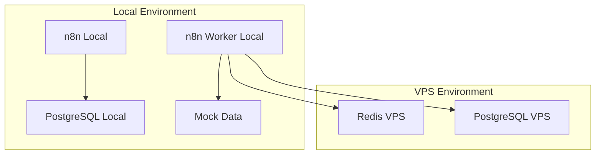

# RFC-006: Data Management & n8n Worker Local (2-Phase Approach)

## 📋 Overview

**RFC ID:** RFC-006  
**Title:** Data Management & n8n Worker Local  
**Status:** Ready for Implementation  
**Dependencies:** RFC-001, RFC-002, RFC-005 (Complete infrastructure)  
**Timeline:** 2 weeks (2-phase approach)  
**Priority:** CRITICAL - Must Have  

**SCOPE UPDATE:** Production Integration Scripts phase has been REMOVED per user request. This RFC now focuses on:
1. ✅ **Phase 1:** Mock Data Generation
2. ✅ **Phase 2:** n8n Worker Local Setup
3. ❌ **Phase 3:** Production Integration Scripts - **REMOVED**

## 🎯 Objectives

### Primary Goals (2-Phase Scope):
1. **Rich Test Data:** Generate realistic mock data cho 16 VPS tables
2. **Worker Functionality:** n8n Worker Local với VPS connectivity
3. **Business Logic Testing:** 22 business scenarios validation
4. **Development Environment:** Complete localhost testing capability

### Removed Goals:
- ❌ Production integration scripts
- ❌ Cross-environment automation
- ❌ Production deployment procedures

## 📊 Implementation Phases

### Phase 1: Mock Data Generation (Week 1)
**Goal:** Create realistic test data cho development

#### Deliverables:
- [ ] 01_users_seeding.sql - 1000 users across 4 tiers
- [ ] 02_workflows_seeding.sql - 200 workflows với categories
- [ ] 03_orders_seeding.sql - 500 orders với payment history
- [ ] 04_executions_seeding.sql - 10,000 executions với metrics
- [ ] 05_community_seeding.sql - Comments, ratings, favorites
- [ ] 06_logging_seeding.sql - Usage logs, transactions, activities
- [ ] 07_worker_seeding.sql - Worker performance logs

#### Business Scenarios (22 scenarios):
- User tier journeys (free → pro → premium → vip)
- Order & payment scenarios (subscriptions, one-time, VIP custom)
- Workflow execution scenarios (high-volume, error handling)
- Community features (ratings, comments, moderation)

### Phase 2: n8n Worker Local (Week 2)
**Goal:** Hybrid worker kết nối VPS production

#### Deliverables:
- [ ] docker-compose.worker.yml configuration
- [ ] VPS connectivity validation (Redis + PostgreSQL)
- [ ] Queue processing với tier priorities
- [ ] Auto-scaling mechanism
- [ ] Worker health monitoring

#### Technical Requirements:
```yaml
n8n-worker-local:
  environment:
    # VPS Connections
    DB_POSTGRESDB_HOST: 103.110.87.247
    QUEUE_BULL_REDIS_HOST: 103.110.87.247
    WEBHOOK_URL: https://n8n.masteryflow.cc/
    
    # Worker Mode
    EXECUTIONS_MODE: queue
    N8N_ENCRYPTION_KEY: ${VPS_ENCRYPTION_KEY}
```

## ✅ Success Criteria (Updated)

### Phase 1 Acceptance:
- [ ] 50,000+ mock records across 16 tables
- [ ] All 22 business scenarios covered
- [ ] Foreign key relationships validated
- [ ] Realistic tier distribution (600/250/120/30)

### Phase 2 Acceptance:
- [ ] VPS Redis connection functional
- [ ] VPS PostgreSQL connection working  
- [ ] Queue priority system working
- [ ] Worker health monitoring active

### Removed Criteria:
- ❌ Production integration testing
- ❌ Cross-environment automation
- ❌ Production deployment validation

## 🔧 Technical Architecture

### Mock Data Strategy:
```sql
-- Tier Distribution
Free Users: 600 (60%)
Pro Users: 250 (25%) 
Premium Users: 120 (12%)
VIP Users: 30 (3%)

-- Data Volume
Users: 1,000
Workflows: 200
Orders: 500
Executions: 10,000
Comments: 2,000
Ratings: 1,500
```

### Worker Architecture:


## 📋 Implementation Scripts

### Automation Scripts:
- [ ] scripts/generate-mock-data.sh - Execute all seeding
- [ ] scripts/setup-worker-local.sh - Worker configuration
- [ ] scripts/validate-mock-data.sh - Data integrity checking
- [ ] scripts/test-business-scenarios.sh - Scenario validation

### Removed Scripts:
- ❌ scripts/production-integration.sh
- ❌ scripts/cross-environment-sync.sh
- ❌ scripts/deployment-automation.sh

## 🚨 Risk Assessment

### Reduced Risks (Due to Scope Reduction):
- ✅ No production environment risks
- ✅ No cross-environment complexity
- ✅ Simplified testing scope

### Remaining Risks:
- **VPS Connectivity:** Redis/PostgreSQL connection stability
- **Data Volume:** Performance với large mock datasets
- **Memory Usage:** Worker memory optimization

## 📊 Success Metrics

| Phase | Metric | Target |
|-------|--------|--------|
| Phase 1 | Mock Data Volume | 50,000+ records |
| Phase 1 | Business Scenarios | 22/22 working |
| Phase 2 | VPS Connectivity | 100% uptime |
| Phase 2 | Worker Memory | <2GB usage |

**Document Version:** 2.0 (2-Phase Scope)  
**Last Updated:** 2024-12-01  
**Scope:** Mock Data + Worker Local Only  
**Status:** Ready for Implementation 